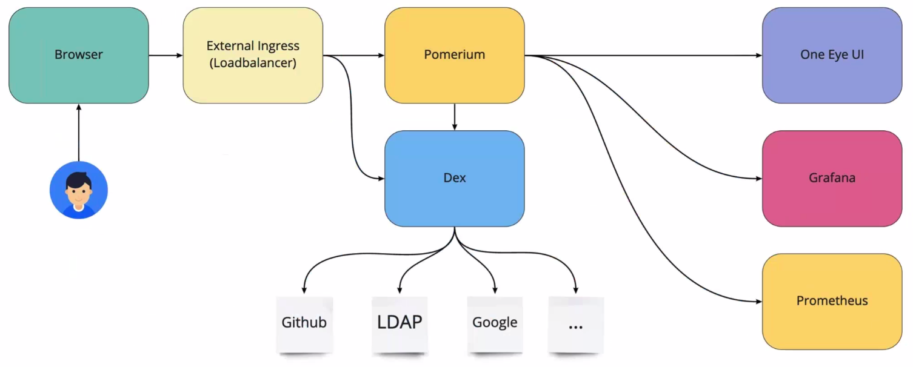

You can secure One Eye access using an external ingress, and authenticate and authorize user connections. The solution is based on [Pomerium](https://github.com/pomerium/pomerium) and [Dex](https://github.com/dexidp/dex), allowing you to use the identity provider of your choice (for example, GitHub or LDAP). You can also apply role based authorization, and assign read-only or read and write access to One Eye.

Authentication uses the latest stable version of cert-manager to ensure secure TLS certificates for external components like Pomerium and Dex. Authentication is performed by Pomerium with the help of Dex through OIDC to authenticate requests to external identity providers.

Pomerium applies route based access policies so that general access to specific components can be gated at the proxy level.

Once the request successfully passes Pomerium, the One Eye Dashboard will check group-role mapping information to identify which groups should have viewer and/or editor access on the UI.

> Note: This doesn't apply to provided components, like Prometheus or the Grafana dashboard, where all users will be viewers. In case you need Grafana administrator access, use the `one-eye ingress connect` command to access the Grafana dashboard as an admin under the `/grafana` subpath.



## Prerequisites

- You already have a working One Eye installation.
- If you want to use GitHub as a backend, register an OAuth app. For details, sees {}.

## Steps

1. Install Pomerium. The following command installs Pomerium and Dex, and configures Dex as well:

    ```bash
    one-eye pomerium install --update
    ```

    The installer will ask you for the following parameters:

    1. **Root domain of Pomerium (localhost.banzaicloud.io)**: Enter the root domain for Pomerium. The default root domain is `localhost.banzaicloud.io`, which is good for experimenting locally, since it resolves to `127.0.0.1`. If you don't use the default, note that:

        - You must configure your DNS to resolve `*.<root-domain>` addresses. (Or at least add `one-eye.<root-domain>`, `authentication.<root-domain>` and the `dex.<root-domain>` to your hosts file pointing to the external ingress' Loadbalancer address.)
        - GitHub authentication will require a custom clientID/secret pair too. For details, see {}.

    1. **Configure GitHub IdP? (Y/n)**: You can configure Dex to authenticate through a GitHub client, or you can use an automatically generated static login.

        - To use static login, enter N. One Eye will automatically generate a static login and display it at after the interactive questions.
        - To use GitHub authentication, enter Y, then provide the GitHub client ID and GitHub Client Secret of the OAuth app you want to use. For details, see {}.

            By default, everyone who successfully completes the authentication needs to be explicitly allowed to pass Pomerium authorization, and additionally to have read and/or write access to One Eye. You can specify user groups that can pass through Pomerium and get read (viewer) or read and write (editor) access in the **spec.authorization.groupRoleMapping** section of the [Observer custom resource](). For example:

            ```yaml
            apiVersion: one-eye.banzaicloud.io/v1alpha1
            kind: Observer
            metadata:
              name: one-eye
            spec:
              authorization:
                groupRoleMapping:
                  example-user: viewer
                  example-admin: editor
            ```

        You can add individual users to an allowlist to pass Pomerium, but they will be authorized to access the One Eye dashboard based on the following conditions:

        - If `groupRoleMapping` is empty, every user in `authorizedUsers` will have the `editor` role.
        - If `groupRoleMapping` has one or more items, then `authorizedUsers` will have roles that are defined by the mapping, so they will *not* have `editor` by default.

1. If you are registering your own domain name, add a wildcard CNAME record to the domain name that resolves to the external ingress endpoint of One Eye. For example, if your root domain is **cloud.example.com**, then `*.cloud.example.com` should resolve to your external ingress endpoint on AWS, like `aefc366f7de9941ccb60f8ad9a0a1dee-1633558956.eu-central-1.elb.amazonaws.com`.

    For load balancers that provision IP addresses, you can set up an A record instead.

    To get the hostname or the IP address of the external ingress endpoint of One Eye, run the following command:

    ```bash
    kubectl get svc one-eye-external-ingress-nginx-controller -o jsonpath='{.status.loadBalancer.ingress[0]}'
    ```

1. Check the ingress resources.

    ```bash
    kubectl get ingress
    ```

    The response contains the remote host in the address field.

    ```bash
    NAME               CLASS                    HOSTS                                                                                                            ADDRESS                                                                   PORTS     AGE
    grafana-ingress    <none>                   localhost                                                                                                        10.10.55.208                                                              80        6m24s
    one-eye-dex        one-eye-nginx-external   dex.localhost.banzaicloud.io                                                                                     a2e92f49fcf6a486a934eec0fb0aff60-1112841772.eu-west-1.elb.amazonaws.com   80        9m40s
    one-eye-ingress    <none>                   localhost                                                                                                        10.10.55.208                                                              80        6m33s
    one-eye-pomerium   one-eye-nginx-external   one-eye.localhost.banzaicloud.io,one-eye.localhost.banzaicloud.io,one-eye.localhost.banzaicloud.io + 3 more...   a2e92f49fcf6a486a934eec0fb0aff60-1112841772.eu-west-1.elb.amazonaws.com   80, 443   9m36s
    ```

    As you can see, the dex and pomerium ingress resources have ingressClassName=one-eye-nginx-external, which means those two are bound to the external ingress controller.

1. Log on to the One Eye web interface using its external address to verify that the authentication is working.

## Use port-forward for debugging

For troubleshooting, you can use port-forwarding to access the ingress directly from localhost without configuring DNS. 

1. Run the following command.

    ```bash
    sudo -E kubectl port-forward svc/one-eye-external-ingress-nginx-controller 443
    ```

1. If you have set a custom root domain, configure the following to resolve to localhost:

    - one-eye.$ROOT_DOMAIN
    - authenticate.$ROOT_DOMAIN
    - dex.$ROOT_DOMAIN

    If you are using the default `localhost.banzaicloud.io` root domain, you can skip this step.

1. Open the https://one-eye.localhost.banzaicloud.io page in your browser, and check the UI.
