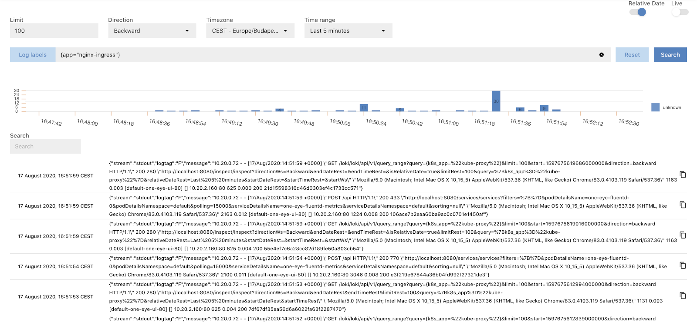

The **MENU > INSPECT** page allows you to search and browse the collected logs using [Loki's LogQL query language](https://grafana.com/docs/loki/latest/logql/).

## Prerequisites

The Loki component of One Eye must be installed.

- To verify that it is installed, check the **MENU > OVERVIEW** page.
- To install the component, use the following command: `one-eye loki install`

## Browsing logs

To search and browse the collected log messages, complete the following steps.

1. Select **MENU > INSPECT**.
    
1. Click **Log labels** and select a predefined query, or enter a [LogQL expression](https://grafana.com/docs/loki/latest/logql/) into the query field.
    
1. Click **Search**. The logs matching the expression are displayed.
    
1. To display the recent logs, select the time range from the **Time range** field.
1. To display the logs of a specific time interval, disable **Relative Date**, fill the start date and end date fields, then click **Search**.
    
1. Clicking on a message opens its details.
    
1. To narrow the search results, you can:
    - click on a detail to add it to the query, or
    - click on the **-** sign to add its negated value to the query.
    - Enter a search string into the **Search** field.

    Click **Search** to filter the results.
1. To change the order the search results are displayed, select
    - **Direction > Backward** to show the newest results first, or
    - **Direction > Forward** to show the oldest results first.

## Live log tailing

To tail your logs, or the logs that match a specific query in real-time, complete the following steps.

1. Select **MENU > INSPECT**.
    
1. Select **Live**.
1. Click **Log labels** and select a predefined query, or enter a [LogQL expression](https://grafana.com/docs/loki/latest/logql/) into the query field.
    
1. Click **Search**. The logs matching the expression are displayed.
1. Click **Autoscroll**.
    
1. Clicking on a message opens its details.
    
1. To narrow the search results, you can:
    - click on a detail to add it to the query, or
    - click on the **-** sign to add its negated value to the query.
    - Enter a search string into the **Search** field.

    Click **Search** to filter the results.
