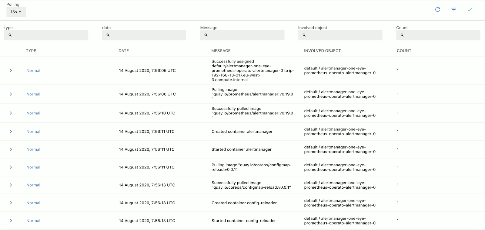
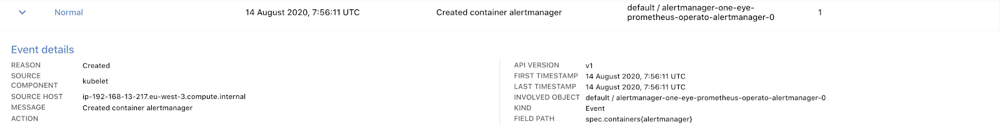

## List of events {#event-list}

The **MENU > CLUSTER EVENTS** page contains the Kubernetes events that occurred on your cluster. You can filter, order, and search events to immediately identify the relevant changes on our cluster.

The list displays the following information about the services:

- **TYPE**: The priority of the event, for example, normal or warning.
- **DATE**: The timestamp of the event.
- **MESSAGE**: The actual message of the event.
- **INVOLVED OBJECT**: The name of the Kubernetes object that logged the event, in namespace/resource format.
- **COUNT**: The number of times the event occurred.

> To quickly find an event, or to filter the list to show only events that match a criteria, click **** to display the filter bar.

Click on an event to display its [details](#event-details).

## Event details {#event-details}

Select an Event from the list to display its details.

The following details are displayed:

- **REASON**: 
- **SOURCE COMPONENT**: 
- **SOURCE HOST**: The node where the event occurred.
- **MESSAGE**: The message of the event.
- **ACTION**: 
- **API VERSION**: 
- **FIRST TIMESTAMP**: The time when the event occurred. If it occurred multiple times, this is the time of the first occurrence.
- **LAST TIMESTAMP**: The time when the event last occurred. If it occurred multiple times, this is the time of the last occurrence.
- **INVOLVED OBJECT**: The name of the Kubernetes object that logged the event, in namespace/resource format.
- **KIND**: 
- **FIELD PATH**: 
