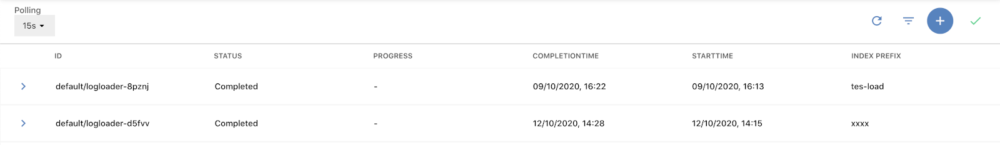
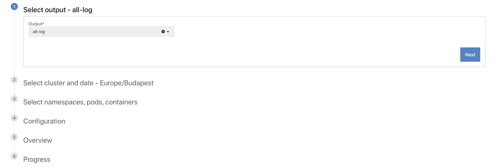
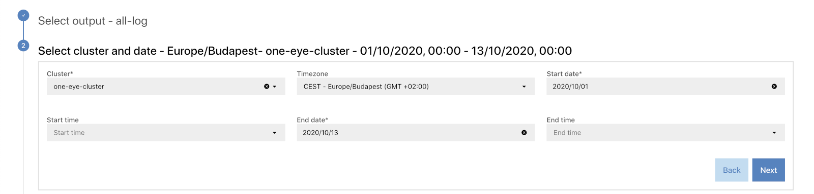
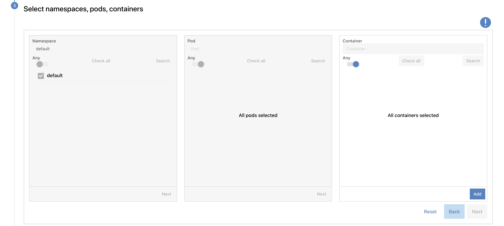
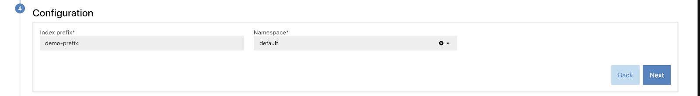
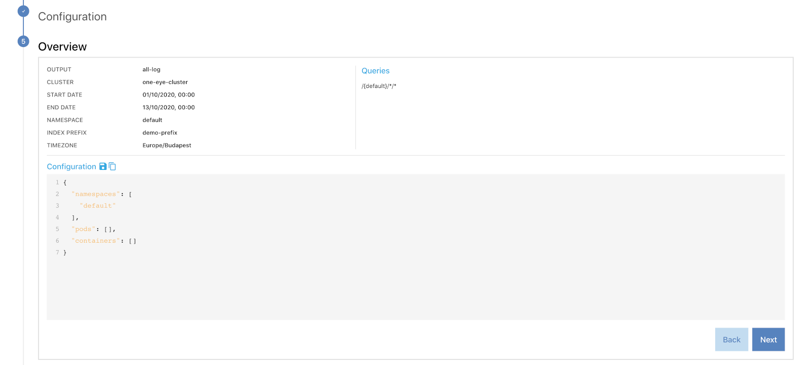
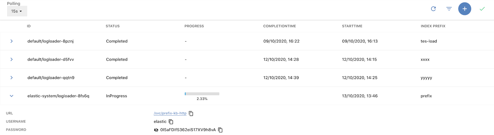
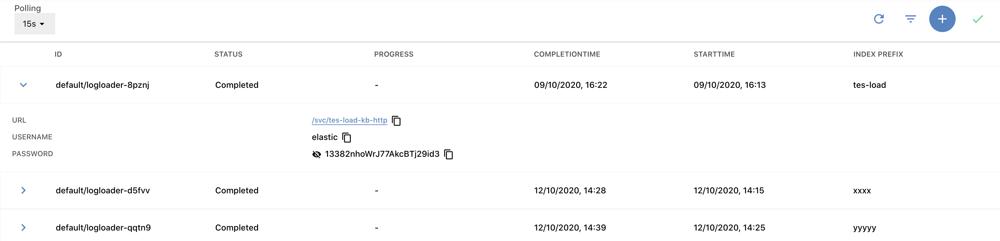

The log restoration feature of One Eye allows you to retrieve a set of logs into an Elasticsearch instance where you can browse and analyze them. This is useful for example in auditing and troubleshooting situations.

## Prerequisites

- Restoring logs is supported only from S3 outputs
- The [Elastic operator](https://github.com/elastic/cloud-on-k8s) must be installed on the cluster running One Eye. You can install the operator from the [One Eye CLI](/docs/one-eye/cli/reference/one-eye_elasticsearch_install/).
- The cluster running One Eye must have enough resources to store the restored logs, and deploy an Elastic instance. The exact requirements depend on the amount of logs to be restored.

## Restore logs

To restore archived log messages, complete the following steps.

1. Open the One Eye web interface by running the **one-eye ingress connect** command.
1. Select **MENU > LOG RESTORATION**.
    
1. Click . The Log Restoration Wizard opens.
    
1. Select the output from which you want to restore logs, then click **Next**.
1. Select the cluster and the time interval for which you want to restore logs.
    
1. To specify the details of the logs to be restored on the UI, select **Simple Builder**. Alternatively, you can select **Advanced Builder**, and paste a [JSON that describes the logs to restore](#builder-json).
1. To restore the logs of only specific namespaces, pods, and containers, search for the name of the respective resource, and select the ones you need. If you want to restore the logs of every resource, select **Any**. Note that searching for the resources returns only exact matches, unless you include the `.*` wildcard.
    
1. Set a prefix for the Elastic index. In addition to using it as a prefix for the Elastic index, currently the Elastic resources are named after this parameter.
    
1. Set the namespace where the Elastic instance will be deployed to. The log restoration job is also run in this namespace.
1. Before restoring the logs starts, review the settings of the process. If everything is as you intended, click **Next**.
    
1. One Eye starts restoring the logs. Depending on the amount of logs to restore, this can take a long time.
    
1. After the job is successfully completed, you can [access the restored logs](#access-logs).

## Access restored logs {#access-logs}

To view your restored logs, complete the following steps.

1. Open the One Eye web interface by running the **one-eye ingress connect** command.
1. Select **MENU > LOG RESTORATION**. This page shows log restoration jobs and their details.
    
1. Click the ID of a restoration job. The details for accessing the logs are displayed.
    
1. Click the URL to open the Elasticsearch service where the logs are available, and use the username and password to access them (click the eye icon to display the password).

## Delete the restored logs

If you're done analyzing the restored logs, you can either:

- deleted the restored logs from Elasticsearch, or
- delete the whole Elasticsearch instance from the One Eye cluster.

Currently, the latter can only be performed manually, by deleting the Elasticsearch resource from the cluster. The Elasticsearch resource is named after the **Index prefix** parameter and exists in the namespace specified for the restoration job. For example, you can run the following command on the cluster:

```bash
kubectl delete elasticsearch -n <namespace> <index prefix>
```

## Advanced builder JSON scheme {#builder-json}

When selecting **Advanced Builder**, you can specify which logs you want to restore in a JSON object. The JSON has three fields, all of them are optional: **namespaces**, **pods**, and **containers**. Each field can contain a list of [RE2](https://github.com/google/re2/wiki/Syntax) regular expressions that match the names of namespaces, pods, or containers to select. Note that:

- If a field is not set, set to `null`, or set to an empty list, it matches every possible value.
- Elements of a list have logical OR relationship.

For example:

Match every pod and container of the namespaces beginning with *kube-*:

```json
{"namespaces": ["kube-.*"]}
```

Match every pod and container of the *default* namespace, and namespaces beginning with *kube-*:

```json
{"namespaces": ["default", "kube-.*"]}
```

Match the logs of the *istio-proxy* containers in the *demo* namespace:

```json
{
    "namespaces": ["demo"],
    "containers": ["istio-proxy"]
}
```
