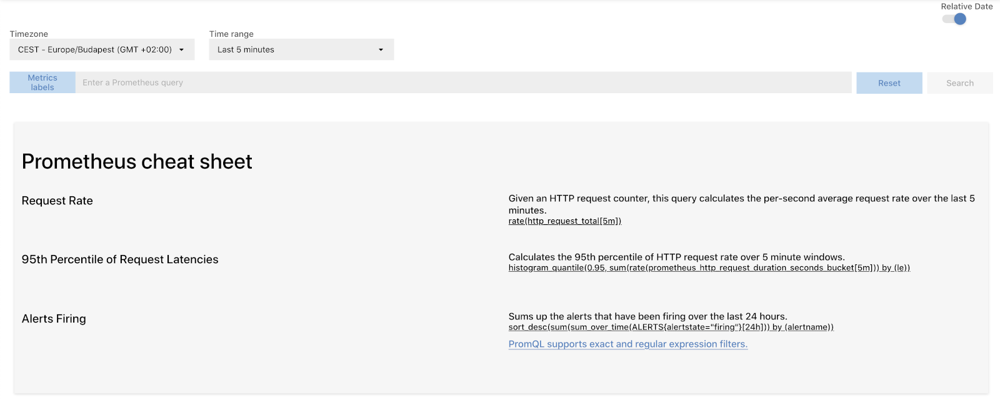
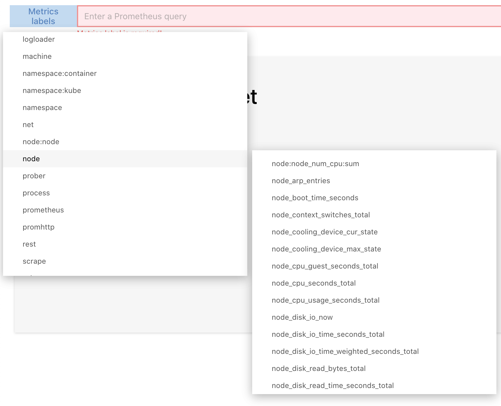
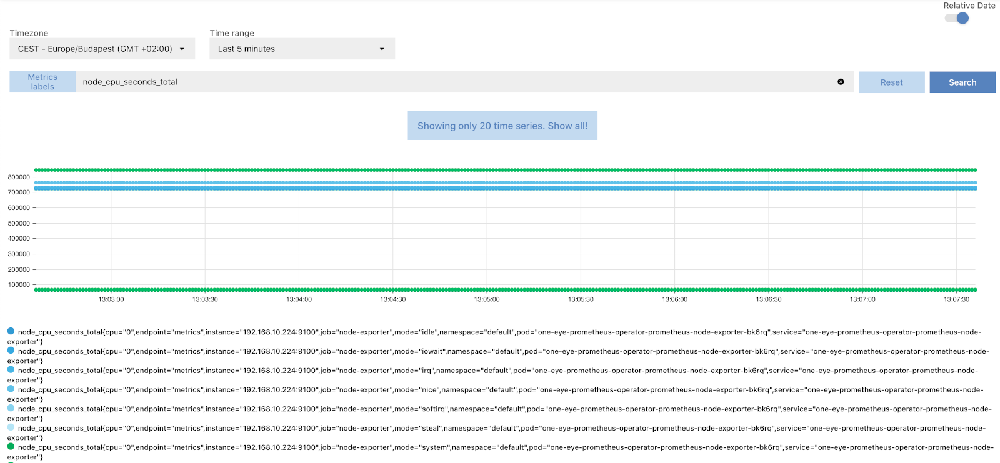
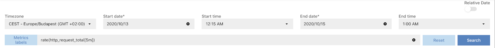

The **MENU > METRICS** page allows you to search and display the collected metrics using the [Prometheus PromQL query language](https://prometheus.io/docs/prometheus/latest/querying/basics/) directly on the One Eye interface.

To search and review the collected metrics, complete the following steps.

1. Select **MENU > METRICS**.
    
1. Click **Metrics labels** and select a predefined query, or enter a [PromQL expression](https://prometheus.io/docs/prometheus/latest/querying/basics/) into the query field.
    
1. Click **Search**. The metrics matching the expression are displayed.
    
1. To display the recent metrics, select the time range from the **Time range** field.
1. To display the metrics of a specific time interval, disable **Relative Date**, fill the start date and end date fields, then click **Search**.
    
