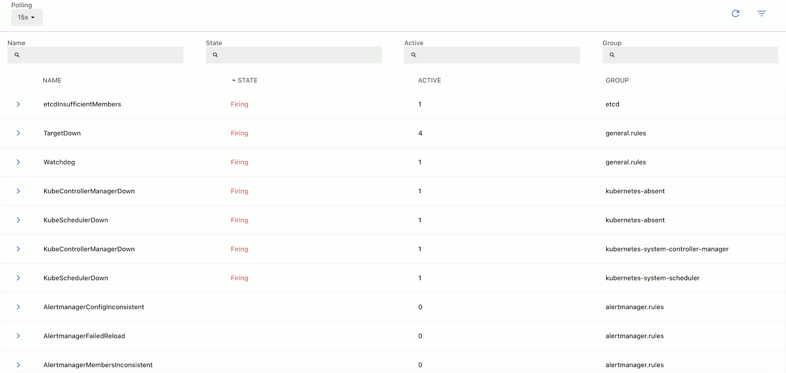
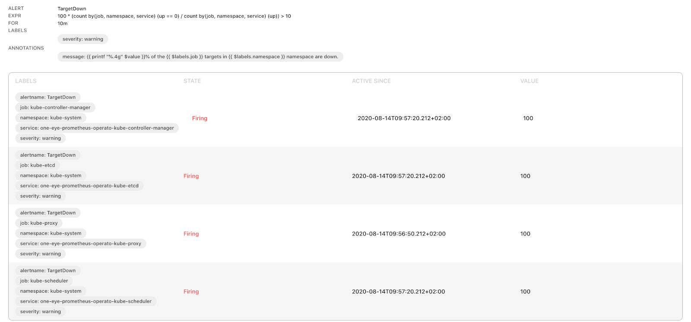

## List of alerts {#alert-list}

The **MENU > ALERTS** page contains information about the alert rules configured on your cluster. One Eye retrieves this information from [Prometheus Alertmanager](https://www.prometheus.io/docs/alerting/latest/alertmanager/). By default, active alerts are displayed on the top of the list.

The list displays the following information about the services:

- **Name**: The name of the alert.
- **State**: Shows if the alert is actively firing.
- **Active**: The number of times the alert has fired.
- **Group**: The group the alerts belongs to. For details, see the [Prometheus Alertmanager documentation](https://www.prometheus.io/docs/alerting/latest/alertmanager/#grouping).

> To quickly find an alert, or to filter the list to show only alerts that match a criteria, click **** to display the filter bar.

Click on an alert to display its [details](#alert-details).

## Alert details {#alert-details}

Select an Alert from the list to display its details.

The following details are displayed:

- **ALERT**: Name of the alert rule.
- **EXPR**: The alert condition.
- **FOR**: The duration the condition must be true for the alert to fire.
- **LABELS**: The labels attached to the alert.
- **ANNOTATIONS**: The annotations attached to the alert.

If the labels contain reference to an existing pod, node, service, or workload, you can click on the label to jump to its details on the [SERVICES](/docs/one-eye/logs-events/services/) or [WORKLOADS](/docs/one-eye/logs-events/workloads/) page.