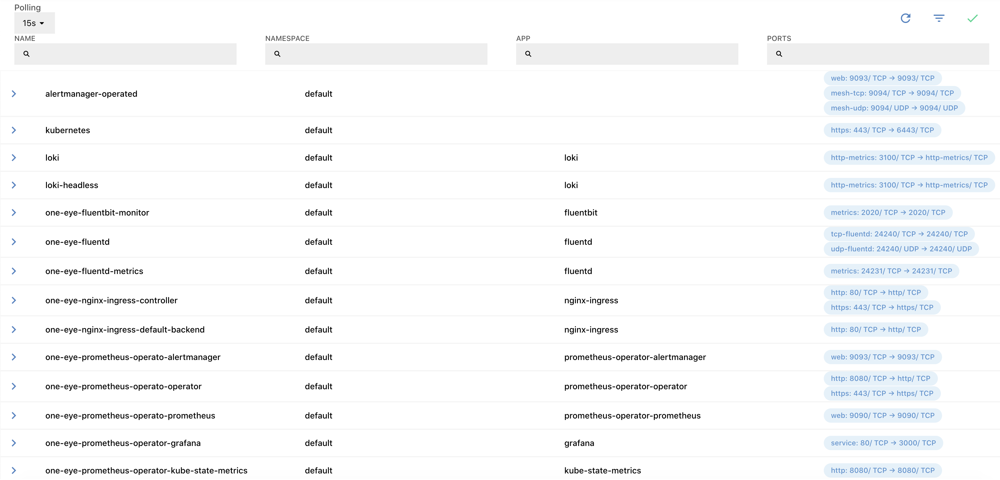
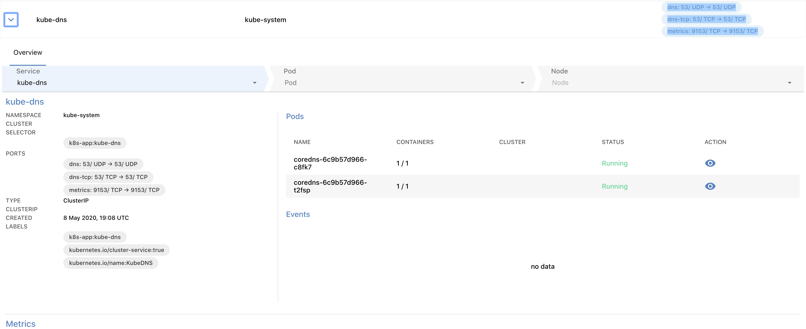
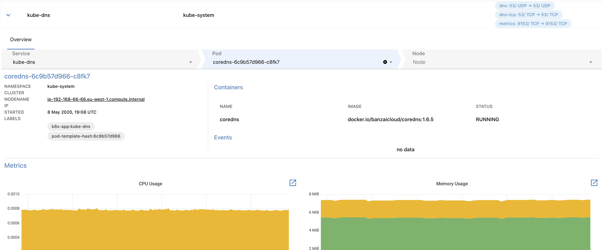
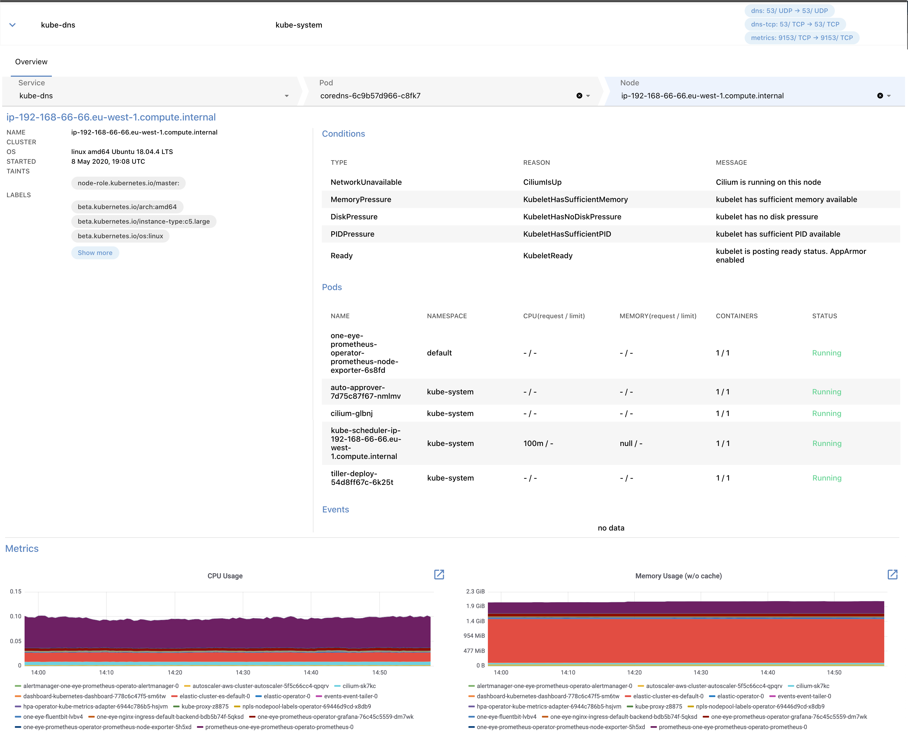

{}

## List of services {#service-list}

The **MENU > SERVICES** page contains information about the services your logging infrastructure collects data from. 



The list displays the following information about the services:

- **Name**: The name of the service.
- **Namespace**: The namespace the service belongs to.
- **APP**: The application exposed using the service.
- **PORTS**: The ports where the service is accessible, for example:

    ```bash
    dns: 53/ UDP → 53/ UDP
    dns-tcp: 53/ TCP → 53/ TCP
    metrics: 9153/ TCP → 9153/ TCP
    ```

> To quickly find a service, or to filter the list to show only services that match a criteria, click **** to display the filter bar.

Click on the name of a service to display its details.

From the services list, you can drill down through the following levels to the underlying resources of the infrastructure: [List of services](#service-list) > [Service](#service) > [Pod](#pod) > [Node](#node)

## Service details {#service}

Select a Service from the list to display its details.



The following details of the service are displayed:

- **Service**: The services exposed in this resource. Click on the name of the service to display the [details of the service](#service).
- **Namespace**: The namespace the service belongs to.
- **CLUSTER**: The name of the Kubernetes cluster the service belongs to.
- **SELECTOR**: The label selector used to select the set of Pods targeted by the Service.
- **PORTS**: The ports where the service is accessible, for example:

    ```bash
    http         8080/TCP → 8080
    grpc         8082/TCP → 8082
    tcp          8083/TCP → 8083
    ```

- **TYPE**: The [ServiceType](https://kubernetes.io/docs/concepts/services-networking/service/#publishing-services-service-types) how your service is exposed, for example, ClusterIP or LoadBalancer.
- **CLUSTER IP**: The IP address corresponding to the ServiceType.
- **CREATED**: The date when the service was started.
- **LABELS**: The list of Kubernetes labels assigned to the resource.
- **Pods**: The list of pods running this service, including their name, number of containers in the pod, and their status. Click on the name of the pod to display the [details of the pod](#pod).
- **Events**: Recent events related to the resource.

## Pod details {#pod}

To check the details of a pod, click the name of the pod in the **PODS** section.



The following details of the pod are displayed:

- **NAMESPACE**: The namespace the pod belongs to.
- **CLUSTER**: The name of the Kubernetes cluster the pod belongs to.
- **NODE**: The hostname of the node the pod is running on, for example, ip-192-168-1-1.us-east-2.compute.internal. Click on the name of the node to display the [details of the node](#node).
- **IP**: The IP address of the pod.
- **STARTED**: The date when the pod was started.
- **LABELS**: The list of Kubernetes labels assigned to the resource.
- **Containers**: The list of containers in the pod. Also includes the Name, Image, and Status of the container.
- **Events**: Recent events related to the resource.
- **Metrics**: Dashboards of the most important metrics. Click  to open the related dashboards in Grafana.

## Node details {#node}

To check the details of a node, select a node in the pod details view. The node view is the deepest layer of the drill-down view and shows information about a Kubernetes node.



The following details of the node that the pod is running on are displayed:

- **CLUSTER**: The name of the Kubernetes cluster the node belongs to.
- **OS**: The operating system running on the node, for example: linux amd64 (Ubuntu 18.04.4 LTS)
- **STARTED**: The date when the node was started.
- **TAINTS**: The list of [Kubernetes taints](https://kubernetes.io/docs/concepts/configuration/taint-and-toleration/) assigned to the node.
- **LABELS**: The list of Kubernetes labels assigned to the node.
- **Conditions**: The [status of the node](https://kubernetes.io/docs/concepts/architecture/nodes/#condition), for example, disk and memory pressure, or network and kubelet status.
- **Pods**: The list of pods currently running on the node.
- **Events**: Recent events related to the node.
- **Metrics**: Dashboards of the most important metrics. Click  to open the related dashboards in Grafana.
