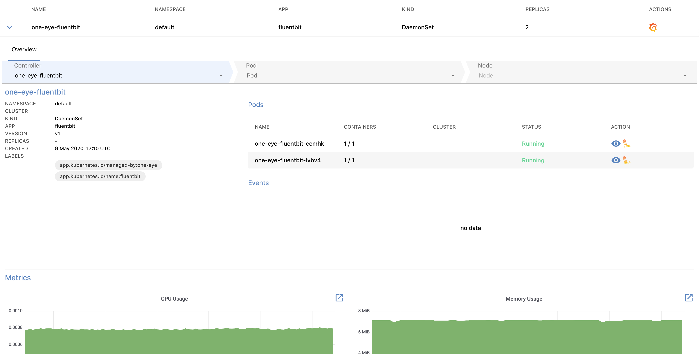
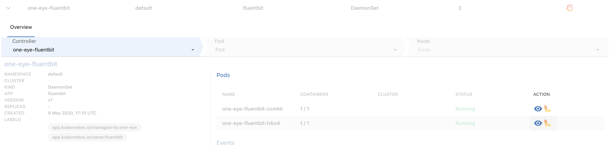
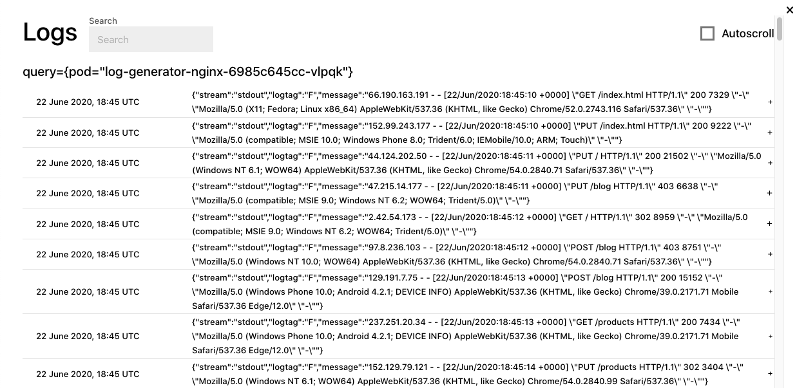
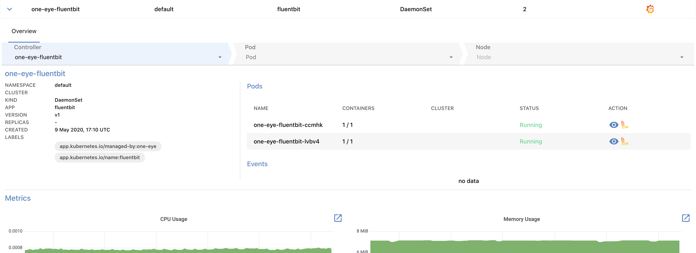
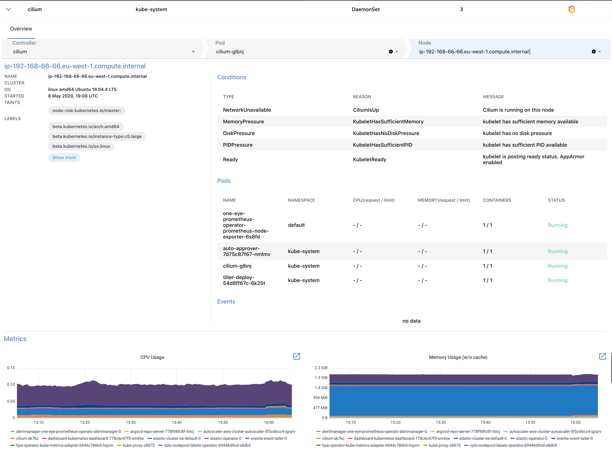

{}

## List of workloads

The **MENU > WORKLOADS** page contains information about the workloads your logging infrastructure collects data from. The list displays the following information about the workloads:

- **NAME**: The name of the workload.
- **NAMESPACE**: The namespace the workload belongs to.
- **APP**: The application running in the workload.
- **KIND**: The kind of the workload, for example, DaemonSet, Deployment, ReplicaSet, or StatefulSet.
- **REPLICAS**: The number of replicas for the workload.

> To quickly find a workload, or to filter the list to show only workloads that match a criteria, click **** to display the filter bar.

Click on the name of a workload to display its details.

From the details overview, you can drill down through the following levels to the underlying resources of the infrastructure: [Overview](#workload-overview) > Controller > [Pod](#pod) > [Node](#node)

## Workload details {#workload-overview}

Select a Workload from the list to display its details.

The following details of the workload are displayed:

- **Controller**: The controllers related to the workload. Click on a controller to display its details.
- **NAMESPACE**: The namespace the workload belongs to.
- **CLUSTER**: The name of the Kubernetes cluster the workload belongs to.
- **KIND**: The kind of the workload, for example, DaemonSet, Deployment, ReplicaSet, or StatefulSet.
- **APP**: The application running in the workload.
- **VERSION**: The version number of the workload, for example, v2.
- **REPLICAS**: The number of replicas for the workload.
- **LABELS**: The list of Kubernetes labels assigned to the resource.
- **Pods**: The list of pods running this workload. Click on the name of the pod to display the [details of the pod](#pod). You can also display, search, and tail the [logs of the pod](#pod-logs).
- **Events**: Recent events related to the resource.
- **Metrics**: Dashboards of the most important metrics. Click  to open the related dashboards in Grafana.

## Pod logs {#pod-logs}

To display the logs of a pod, click  icon in the **ACTION** column of the pod.

You can search in the logs of the pod, or tail them by selecting **Autoscroll**.

## Pod details {#pod}

To check the details of a pod, click the name of a pod in the **Pods** section.

The following details of the pod are displayed:

- **NAMESPACE**: The namespace the pod belongs to.
- **CLUSTER**: The name of the Kubernetes cluster the pod belongs to.
- **NODE**: The hostname of the node the pod is running on, for example, ip-192-168-1-1.us-east-2.compute.internal. Click on the name of the node to display the [details of the node](#node).
- **IP**: The IP address of the pod.
- **STARTED**: The date when the pod was started.
- **LABELS**: The list of Kubernetes labels assigned to the resource.
- **Containers**: The list of containers in the pod. Also includes the Name, Image, and Status of the container.
- **Events**: Recent events related to the resource.
- **Metrics**: Dashboards of the most important metrics. Click  to open the related dashboards in Grafana.

## Node details {#node}

To check the details of a node, select a node in the pod details view. The node view is the deepest layer of the drill-down view and shows information about a Kubernetes node.

The following details of the node that the pod is running on are displayed:

- **CLUSTER**: The name of the Kubernetes cluster the node belongs to.
- **OS**: The operating system running on the node, for example: linux amd64 (Ubuntu 18.04.4 LTS)
- **STARTED**: The date when the node was started.
- **TAINTS**: The list of [Kubernetes taints](https://kubernetes.io/docs/concepts/configuration/taint-and-toleration/) assigned to the node.
- **LABELS**: The list of Kubernetes labels assigned to the node.
- **Conditions**: The [status of the node](https://kubernetes.io/docs/concepts/architecture/nodes/#condition), for example, disk and memory pressure, or network and kubelet status.
- **Pods**: The list of pods currently running on the node.
- **Events**: Recent events related to the node.
- **Metrics**: Dashboards of the most important metrics. Click  to open the related dashboards in Grafana.
