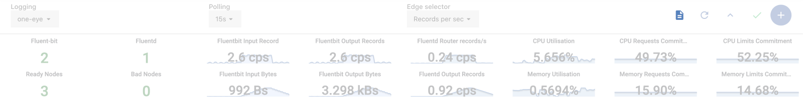
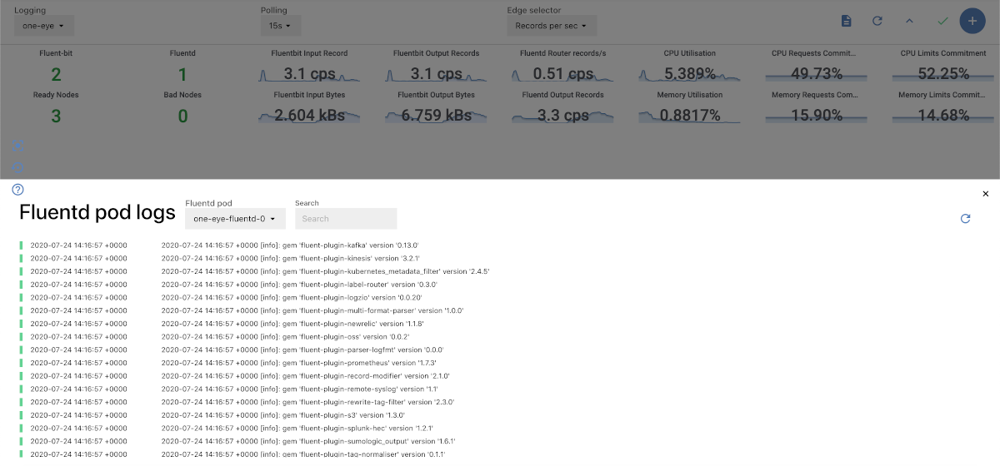

## Check Fluentd logs

One Eye doesn't send Fluentd logs to the standard output, because a bad configuration can cause a self-perpetuating process, generating logs exponentially. To avoid this, Fluentd logs are stored inside the container under the `/fluentd/log/out` path.

To debug the Logging operator, always check the Fluentd logs first. In One Eye, you can access and search these logs from the web UI:

1. Navigate to ** > LOGGING OVERVIEW > **. A panel opens showing the Fluentd pod logs.

    

1. If you are running multiple replicas, select which Fluentd pod you want to query.
1. Browse the logs, or use the **Search** field.

    

## Explain Observer configuration {#explain}

To display the documentation of the Observer custom resource, you can use the **one-eye explain** command, which is similar to *kubectl explain*. For example:

```bash
$ one-eye observer explain spec
KIND:     Observer
VERSION:  one-eye.banzaicloud.io/v1alpha1

RESOURCE: spec <Object>

DESCRIPTION:
     ObserverSpec defines the desired state of Observer

FIELDS:
   certmanager <Object>
     CertManager component descriptor

   clusterName <string>
     Custom name for cluster
...
```